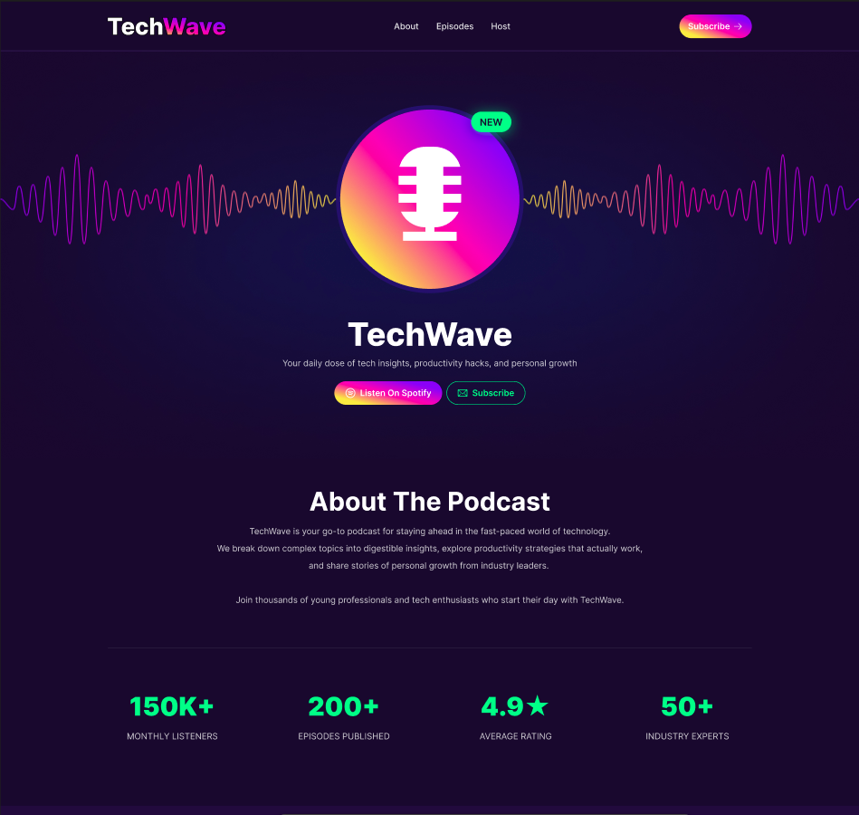
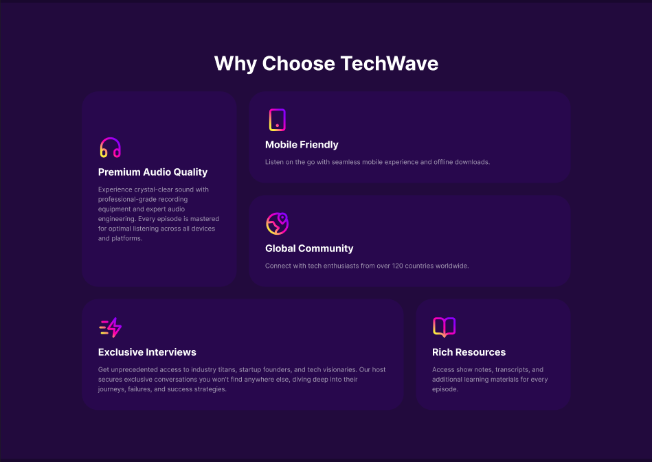

# 🎧 TechWave – Podcast Landing Page

TechWave is a modern, responsive landing page designed for a tech-focused podcast. The project features a sleek dark-themed UI, vibrant gradients, and a clean layout to showcase podcast episodes, host information, and platform links.

---

## 🚀 Live Demo

- <a href="https://ab-siddik-ru-cse.github.io/TechWave/"><b>Visit TechWave</b></a>

## 📸 Preview

### 🎯 Hero Section
Modern hero section with call-to-action buttons and dynamic wave aesthetics.

### 🎙️ Features & Episodes
Detailed grid showing **"Why Choose TechWave"** and **"Featured Episodes."**

### 👤 Host & Footer
Host bio section and a clean, informative footer.

---

## ✨ Features

- 📱 **Fully Responsive Design**  
  Optimized for desktops, tablets, and mobile devices.

- 🎨 **Modern UI/UX**  
  High-contrast dark mode with neon gradient accents.

- 🧩 **Custom Components**
  - Interactive episode cards with hover effects  
  - Dynamic statistics counter section  

- 🔗 **Platform Integration**  
  Integrated social media and podcast platform links (Spotify, Apple Podcasts, etc.)

- 🧱 **Bento-style Grid**  
  Used for the "Why Choose" section to organize information cleanly.

---

## 🛠️ Tech Stack

- **HTML5**  
  Semantic structure for better SEO and accessibility.

- **CSS3**
  - Flexbox & CSS Grid for layout management  
  - CSS Variables for consistent branding and colors  
  - Media Queries for responsiveness  
  - Transitions and hover animations  

